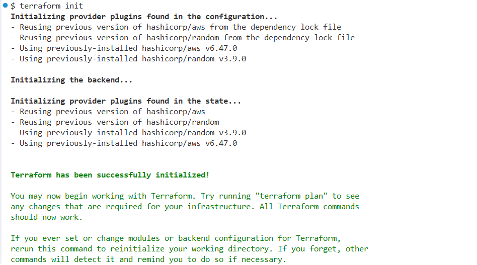
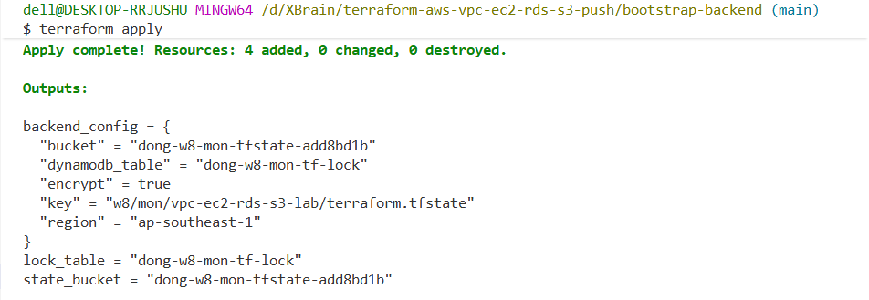
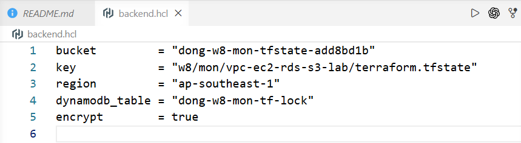
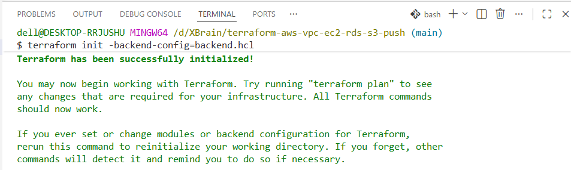
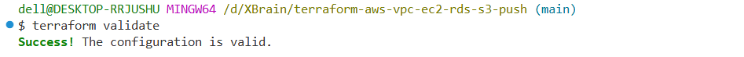
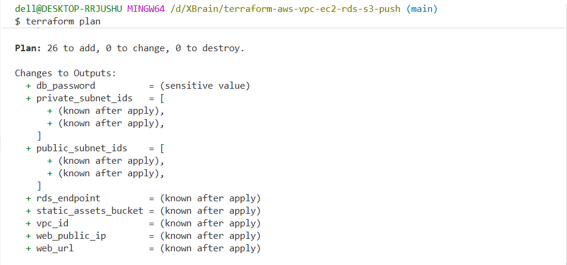
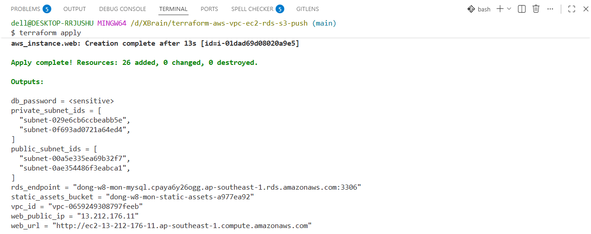
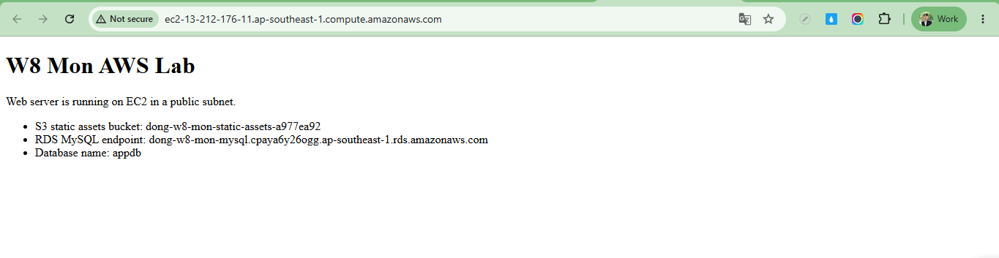

# Final Project: Deploy a Web App on AWS with Terraform

## 1. Mục tiêu dự án

Dự án này triển khai một nền tảng web app cơ bản trên AWS bằng Terraform theo yêu cầu final project:

- Tạo VPC module có public subnets và private subnets.
- Triển khai EC2 instance trong public subnet để làm web server.
- Triển khai RDS MySQL trong private subnets.
- Tạo S3 bucket để lưu static assets.
- Cấu hình security groups chỉ cho phép traffic cần thiết.
- Lưu Terraform state trên S3 backend và dùng DynamoDB để state locking.

## 2. Kiến trúc tổng quan

```text
Internet
   |
   v
Internet Gateway
   |
   v
Public Route Table
   |
   v
Public Subnet
   |
   v
EC2 Web Server
   |
   |---> S3 Static Assets Bucket
   |
   | MySQL traffic only from EC2 Security Group
   v
Private Subnets
   |
   v
RDS MySQL

Terraform State:
Local Terraform CLI ---> S3 Backend Bucket + DynamoDB Lock Table
```

Luồng truy cập chính:

1. User truy cập web app qua HTTP port `80`.
2. Internet Gateway route traffic vào public subnet.
3. EC2 web server phản hồi trang web được tạo từ `user-data.sh.tftpl`.
4. EC2 có quyền đọc/ghi S3 static assets bucket qua IAM role.
5. RDS MySQL nằm trong private subnets, không có public access.
6. RDS chỉ nhận MySQL traffic port `3306` từ security group của EC2 web server.
7. Terraform state được lưu trong S3 backend, DynamoDB table dùng để lock state khi chạy Terraform.

## 3. Cấu trúc dự án

```text
.
|-- bootstrap-backend/
|   |-- main.tf          # Tạo S3 bucket lưu Terraform state và DynamoDB lock table
|   |-- outputs.tf       # Xuất bucket/table để copy vào backend.hcl
|   |-- providers.tf     # AWS provider cho bootstrap stack
|   |-- variables.tf     # Region và prefix cho backend resources
|   `-- versions.tf      # Required Terraform/provider versions
|
|-- modules/
|   `-- vpc/
|       |-- main.tf      # VPC, Internet Gateway, public/private subnets, route tables
|       |-- outputs.tf   # VPC ID, public subnet IDs, private subnet IDs
|       `-- variables.tf # Input variables và validation cho VPC module
|
|-- backend.hcl.example  # Template cấu hình S3 backend
|-- command.txt          # Tóm tắt lệnh chạy project
|-- main.tf              # EC2, RDS, S3, IAM, security groups, gọi VPC module
|-- outputs.tf           # Output web URL, public IP, RDS endpoint, S3 bucket
|-- providers.tf         # AWS provider region
|-- user-data.sh.tftpl   # Script cài Apache và tạo trang web trên EC2
|-- variables.tf         # Input variables cho root module
`-- versions.tf          # Terraform backend S3 và provider versions
```

## 4. Thành phần đã triển khai

### 4.1 VPC module

File chính: `modules/vpc/main.tf`

Đã triển khai:

- `aws_vpc` với DNS support và DNS hostnames.
- `aws_internet_gateway` gắn vào VPC.
- Public subnets, có `map_public_ip_on_launch = true`.
- Private subnets, dùng cho RDS.
- Public route table có route `0.0.0.0/0` đi Internet Gateway.
- Private route table riêng cho private subnets.
- Output subnet IDs để root module dùng triển khai EC2 và RDS.

### 4.2 EC2 web server trong public subnet

File chính: `main.tf`, `user-data.sh.tftpl`

Đã triển khai:

- EC2 dùng Amazon Linux 2023 AMI mới nhất.
- EC2 nằm trong public subnet đầu tiên của VPC module.
- EC2 có public IP để truy cập HTTP.
- User data cài `httpd`, bật service Apache và tạo trang `index.html`.
- IAM role + instance profile cho phép EC2 truy cập S3 static assets bucket.

### 4.3 RDS MySQL trong private subnets

File chính: `main.tf`

Đã triển khai:

- `aws_db_subnet_group` dùng private subnet IDs từ VPC module.
- `aws_db_instance` engine MySQL.
- `publicly_accessible = false` để RDS không public ra Internet.
- Password được generate bằng `random_password`.
- Security group database chỉ cho port `3306` từ web security group.

### 4.4 S3 bucket cho static assets

File chính: `main.tf`

Đã triển khai:

- S3 bucket tên duy nhất bằng `random_id`.
- Bật versioning.
- Bật server-side encryption `AES256`.
- Block toàn bộ public access.
- EC2 được cấp quyền `s3:ListBucket`, `s3:GetObject`, `s3:PutObject` qua IAM policy.

### 4.5 Security groups

File chính: `main.tf`

Đã triển khai:

- Web security group:
  - Allow HTTP `80` từ Internet.
  - SSH `22` bị tắt mặc định.
  - Nếu cần SSH để lab/demo, set `allowed_ssh_cidr` bằng IP cá nhân dạng `/32`.
- Database security group:
  - Allow MySQL `3306` chỉ từ web security group.
  - Không mở MySQL ra Internet.

### 4.6 Remote state backend

File chính: `versions.tf`, `bootstrap-backend/main.tf`, `backend.hcl.example`

Đã triển khai:

- Root module khai báo `backend "s3" {}`.
- Bootstrap stack tạo S3 bucket để lưu state.
- Bootstrap stack tạo DynamoDB table với hash key `LockID` để Terraform state locking.
- Backend S3 bật encryption.

## 5. Flow triển khai

### Step 1: Bootstrap backend

Chạy stack backend trước vì Terraform không thể vừa tạo backend vừa dùng backend đó trong cùng một lần apply.

```powershell
cd bootstrap-backend
terraform init
terraform apply
```

Sau khi apply xong, lấy output:

- `state_bucket`
- `lock_table`
- `backend_config`

Minh chứng:





### Step 2: Tạo backend.hcl

Copy file mẫu:

```powershell
cd ..
Copy-Item backend.hcl.example backend.hcl
```

Cập nhật `backend.hcl` bằng output từ bootstrap:

```hcl
bucket         = "your-bootstrap-state-bucket"
key            = "w8/mon/vpc-ec2-rds-s3-lab/terraform.tfstate"
region         = "ap-southeast-1"
dynamodb_table = "your-bootstrap-lock-table"
encrypt        = true
```

Minh chứng:



### Step 3: Init root module với S3 backend

```powershell
terraform init -backend-config=backend.hcl
```

Minh chứng:



### Step 4: Validate và review plan

```powershell
terraform validate
terraform plan
```

Minh chứng:





### Step 5: Apply infrastructure

```powershell
terraform apply
```

Minh chứng:



### Step 6: Test web server

Lấy URL từ output:

```powershell
terraform output web_url
```

Mở URL trên browser để kiểm tra EC2 web server trả về trang Apache được tạo bởi user data.

Minh chứng:



## 6. Checklist kiểm tra yêu cầu project

Kết luận: project đã đáp ứng các yêu cầu chính của final project.

- [x] Tạo VPC bằng Terraform module riêng trong `modules/vpc`.
- [x] Tạo public subnets và private subnets cho kiến trúc web app.
- [x] Cấu hình Internet Gateway và public route table để public subnet truy cập Internet.
- [x] Triển khai EC2 web server trong public subnet.
- [x] EC2 có public IP và web app truy cập được qua HTTP port `80`.
- [x] Triển khai RDS MySQL trong private subnets thông qua DB subnet group.
- [x] RDS không public ra Internet với `publicly_accessible = false`.
- [x] Tạo S3 bucket cho static assets, có versioning, encryption và block public access.
- [x] Gán IAM role/policy để EC2 có quyền truy cập S3 static assets bucket.
- [x] Cấu hình security group chỉ mở traffic cần thiết: HTTP `80` cho web và MySQL `3306` từ EC2 sang RDS.
- [x] Tắt SSH mặc định; chỉ mở SSH khi cấu hình `allowed_ssh_cidr` rõ ràng.
- [x] Lưu Terraform state bằng S3 backend.
- [x] Dùng DynamoDB table để lock Terraform state.
- [x] Có output kiểm tra kết quả triển khai: `web_url`, `web_public_ip`, `rds_endpoint`, `static_assets_bucket`.
- [x] Có ảnh minh chứng cho các bước bootstrap, init backend, validate, plan, apply và test web server ở phần 5.

## 7. Security notes

- SSH vào EC2 bị disable mặc định để tránh mở `22` ra Internet.
- Nếu cần SSH trong lúc demo, cấu hình:

```hcl
allowed_ssh_cidr = "your-public-ip/32"
```

- RDS MySQL không public ra Internet.
- S3 static assets bucket đang block public access và bật encryption.
- Database password được generate tự động bằng Terraform `random_password` và output được đánh dấu `sensitive`.

## 8. Cleanup

Destroy application stack trước, sau đó mới destroy backend stack.

```powershell
terraform destroy
cd bootstrap-backend
terraform destroy
```

Lý do: nếu xóa backend trước, Terraform root module có thể mất nơi lưu state và lock state.
